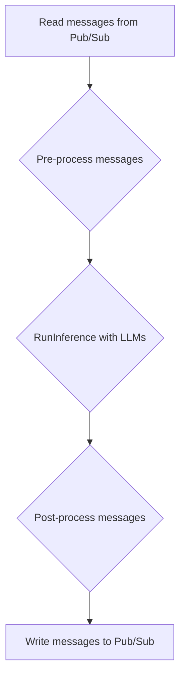

# Beam LLM

Bring your LLM models to production with `beamllm`.

> **Note:** This project uses the [Dataflow ML Starter project](https://github.com/google/dataflow-ml-starter) as the template.

The Beam pipeline to deploy an LLM model using Dataflow is:



Each message is associated with a chat session ID, which guarantees the receiver only gets the messages for the corresponding session.

## How to run

### Prerequisites

* Python 3.10 (to support both Tensorflow and Pytorch in the containers)
* Tools: conda, git, make, docker, gcloud, python3-venv
* Access to a GCP project

### Modify `.env`

`FLAN-T5-small`, `gemma_instruct_2b_en`, and `ollama` models are supported.
`INPUT_TOPIC` and `OUTPUT_TOPIC` define two Pub/Sub topics for message ins and outs.

### Steps to run this demo

#### 1. Get the code

```bash
git clone https://github.com/liferoad/beamllm.git
cd beamllm
```

#### 2. Set up the environment

```bash
# Create venv for this demo
make init
# Build custom container that contains the T5 model
make docker_t5
# Build custom container that contains the gemma_2b model
make docker_gemma_2b
# Build custom container that contains the ollama model support
make docker_ollama
```

#### 3. Deploy and interact with the model

```bash
# Deploy an LLM model using Dataflow
make run-gpu
# Chat with the model
make run-chat
# Chat with the model using mesop
mesop beamllm/mesop_chat.py
```

### Code Structure

#### beamllm

* [pipeline.py](https://github.com/liferoad/beamllm/blob/main/beamllm/pipeline.py) defines the Beam pipeline.
* [config.py](https://github.com/liferoad/beamllm/blob/main/beamllm/config.py) configures the model information.
* [chat.py](https://github.com/liferoad/beamllm/blob/main/beamllm/chat.py) provides a simple chat interface. It publishes the user's message to the input Pub/Sub topic by adding a unique session ID and keeps listening for the response from the output topic.

> **Note:** In order to run `gemma_instruct_2b_en`, `g2-standard-4` with L4 GPUs must be used.

#### models

* flan_t5.py: handles the FLAN-T5-small model.
* gemma.py: Handles the gemma_instruct_2b_en model.
* ollama.py: Handles the Ollama models

### Examples

#### FLAN-T5-small

```bash
Listening for messages on projects/apache-beam-testing/subscriptions/llm_output-32555ae3-e8b1-4977-a7db-015f22ee2c51..

Enter message to chat (Ctrl-Break to exit): translate English to Spanish: We are in New York City.
Bot 32555ae3-e8b1-4977-a7db-015f22ee2c51: Estamos en Nueva York City.

Enter message to chat (Ctrl-Break to exit): what is the sky color
Bot 32555ae3-e8b1-4977-a7db-015f22ee2c51: a blue sky

Enter message to chat (Ctrl-Break to exit): ^CExiting...
Subscription deleted: projects/apache-beam-testing/subscriptions/llm_output-32555ae3-e8b1-4977-a7db-015f22ee2c51.
Chat finished.
```

#### gemma_instruct_2b_en

```bash
Listening for messages on projects/apache-beam-testing/subscriptions/llm_output-d72a5af2-7d81-4ded-aa94-b602931c4d9d..

Enter message to chat (Ctrl-Break to exit): Keras is
Bot d72a5af2-7d81-4ded-aa94-b602931c4d9d: Keras is a deep learning library for Python that provides a wide range of tools and functionalities for building, training, and evaluating deep learning models.

**Key Features of Keras:**

* **TensorFlow integration:** Keras provides seamless integration with the TensorFlow deep learning library, allowing you to leverage the vast resources and capabilities of TensorFlow.
* **High-level API:** The Keras API is designed to be intuitive and easy to use, making it accessible to both beginners and experienced developers.
* **Extensive tools and functionalities:** Keras offers a wide range of tools and functionalities, including data loading, data preprocessing, model building, training, evaluation, and more.
* **Pre-built models and examples:** Keras provides a variety of pre-built models and examples that you can use as a starting point for your projects.
* **Community support:** Keras has a large and active community of developers and users who provide support, resources, and best practices.

**Use Cases of Keras:**

* Building and training deep learning models for various tasks, including image classification, natural language processing, and machine learning.
* Leveraging TensorFlow's vast resources and capabilities for building and training complex deep learning models.
* Creating high-quality and efficient deep learning models with
Enter message to chat (Ctrl-Break to exit): what is apache beam
Bot d72a5af2-7d81-4ded-aa94-b602931c4d9d: what is apache beam?

Apache Beam is an open-source framework for building distributed data processing pipelines. It allows you to write code once and run it on different data processing platforms, including Apache Hadoop, Apache Spark, Apache Flink, and Apache Beam itself.

Here's a breakdown of the key features of Apache Beam:

* **Pipelined data processing:** Beam pipelines data through a series of steps, similar to a traditional data processing workflow.
* **Flexible data sources and formats:** Beam can read data from various sources, including Apache Hadoop, Apache Spark, Apache Flink, and cloud storage.
* **Rich data processing capabilities:** Beam provides a wide range of operators and transformations for data processing, including filtering, sorting, aggregation, and joining.
* **Parallel execution:** Beam can run pipelines in parallel on multiple data processing platforms, improving performance.
* **Open-source and free:** Beam is an open-source project, making it accessible and free to use.

Here are some of the use cases for Apache Beam:

* **Data pipeline development:** Beam can be used to build and execute data pipelines that move data between different systems.
* **Data analysis:** Beam can be used to analyze data by performing various operations
```

### Run the Ollama models (Recommended)

With `make docker_ollama`, the custom container is built on top of the Ollama container to run the streaming Beam pipeline.
`beamllm/models/ollama.py` creates a custom Ollama model handler, which allows users to specify any supported Ollama models.
The default model is `llama3`.

> **Note:** Since Ollama needs to download the model on the fly, Dataflow workers should be able to connect to the internet.

One example output for `ollama` with `llama3` is:

```bash
Listening for messages on projects/apache-beam-testing/subscriptions/llm_output-f39cef17-0d4b-4dc6-8460-fd6005a9a553..

Enter message to chat (Ctrl-Break to exit): why is the sky blue in one sentence?
Bot f39cef17-0d4b-4dc6-8460-fd6005a9a553: The sky appears blue because of a phenomenon called Rayleigh scattering, where shorter blue wavelengths of sunlight are scattered more efficiently by tiny molecules of gases in the Earth's atmosphere, making them more visible to our eyes than longer red and orange wavelengths.
```

## To Do

* Polish the interface to package everything with a CLI package

## Links

* [Dataflow Inference with PyTorch](https://cloud.google.com/dataflow/docs/notebooks/run_inference_pytorch)
* [Dataflow Pub/Sub Example](https://github.com/GoogleCloudPlatform/dataflow-cookbook/tree/main/Python/pubsub)
* [Generative AI with Dataflow](https://cloud.google.com/dataflow/docs/notebooks/run_inference_generative_ai)
* [Running Inference with Gemma](https://cloud.google.com/dataflow/docs/machine-learning/gemma-run-inference)
* [Gemma Model on Kaggle](https://www.kaggle.com/models/google/gemma)
* [TensorFlow GPU Installation](https://www.tensorflow.org/install/source#gpu)
* [PyTorch Installation](https://pytorch.org/get-started/locally/)
* [NVIDIA CUDA Containers](https://catalog.ngc.nvidia.com/orgs/nvidia/containers/cuda/tags)
* [TensorFlow PIP Installation](https://www.tensorflow.org/install/pip)
